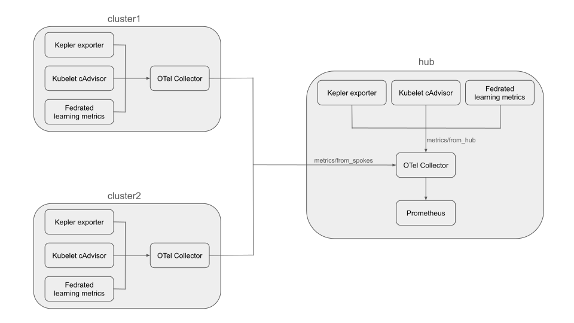

# installation doc

## **Prerequisite**

We will deploy in the [Kind](https://kind.sigs.k8s.io/) environment.

## Architecture

Prepare 3 clusters: Hub, Cluster1, Cluster2.



## Install kube-prometheus on Hub

We can install kube-prometheus on Hub according to the document: [deploy the prometheus operator](https://sustainable-computing.io/installation/kepler/#deploy-the-prometheus-operator).

## Install Kepler and OpenTelemetry Operator on all clusters

In our architecture, each cluster needs to install Kepler and OTel Operator.

### Install Kepler

[Deploy Kepler on Kind](https://sustainable-computing.io/installation/kepler/#deploying-kepler-on-a-local-kind-cluster) clusters.

**NOTE**: We set `OPTS=""` here, because we will get Kepler metrics by using OTel Collector instead of using kube-prometheus directly.

```bash
git clone --depth 1 git@github.com:sustainable-computing-io/kepler.git
cd ./kepler
make build-manifest OPTS=""
kubectl apply -f _output/generated-manifest/deployment.yaml
```

### Install OpenTelemetry Operator

This step we will install [OpenTelemetry Operator](https://opentelemetry.io/docs/platforms/kubernetes/operator/#getting-started).

```bash
# 1. Install cert-manager
kubectl apply -f https://github.com/cert-manager/cert-manager/releases/latest/download/cert-manager.yaml

# Wait for cert-manager to finish installing...

# 2. Install OTel Operator
kubectl apply -f https://github.com/open-telemetry/opentelemetry-operator/releases/latest/download/opentelemetry-operator.yaml
```

## Create OTel Collector on Hub

### Grant RBAC permissions

RBAC permissions are necessary because the OpenTelemetry Collector needs to interact directly with the Kubernetes API. It requires access to discover resources like pods and nodes for service discovery, and to proxy requests through the API server to scrape internal metrics endpoints such as cAdvisor. Without these permissions, the collector cannot find or access its scrape targets within the cluster.

Grant RBAC permissions.

```bash
kubectl apply -f hub-otel-collector-rbac.yaml
```

```yaml
# hub-otel-collector-rbac.yaml
apiVersion: rbac.authorization.k8s.io/v1
kind: ClusterRole
metadata:
  name: otel-collector-kubeletstats-role
rules:
- apiGroups: [""]
  resources:
  - "nodes"
  - "nodes/stats"
  - "nodes/proxy"
  - "services"
  - "pods"
  verbs:
  - "get"
  - "list"
  - "watch"
---
apiVersion: rbac.authorization.k8s.io/v1
kind: ClusterRoleBinding
metadata:
  name: otel-collector-kubeletstats-binding
subjects:
- kind: ServiceAccount
  name: hub-collector
  namespace: default
roleRef:
  kind: ClusterRole
  name: otel-collector-kubeletstats-role
  apiGroup: rbac.authorization.k8s.io
```

### Create OTel Collector

Now we can create the OpenTelemetry Collector.

We will create 2 pipelines, the first pipeline `metrics/from_hub` is to receive metrics from hub's Kepler exporter, kubelet cadvisor and federated learning metrics, the second pipeline `metrics/from_spokes` is to receive metrics from cluster1 and cluster2.

```bash
kubectl apply -f hub-collector.yaml
```

```yaml
# hub-collector.yaml
apiVersion: opentelemetry.io/v1beta1
kind: OpenTelemetryCollector
metadata:
  name: hub
spec:
  image: otel/opentelemetry-collector:latest
  config:
    receivers:
      prometheus:
        config:
          scrape_configs:
            # Scrape config for Kepler pods.
            - job_name: 'kepler-pods'
              kubernetes_sd_configs:
                - role: pod
              relabel_configs:
                # Keep only pods in the 'kepler' namespace.
                - source_labels: [__meta_kubernetes_namespace]
                  action: keep
                  regex: kepler
                # Standard relabeling to construct the scrape address from pod IP and port.
                - source_labels: [__address__, __meta_kubernetes_pod_container_port_number]
                  action: replace
                  regex: ([^:]+):(?:\d+);(\d+)
                  replacement: $${1}:$${2}
                  target_label: __address__
                # Use the node name as the 'instance' label for clarity.
                - source_labels: [__meta_kubernetes_node_name]
                  action: replace
                  target_label: instance

            # Scrape config for cAdvisor metrics from all Kubernetes nodes.
            - job_name: 'kubernetes-cadvisor-central'
              kubernetes_sd_configs:
                - role: node
              scheme: https
              authorization:
                credentials_file: /var/run/secrets/kubernetes.io/serviceaccount/token
              tls_config:
                ca_file: /var/run/secrets/kubernetes.io/serviceaccount/ca.crt
                insecure_skip_verify: true
              relabel_configs:
                - action: labelmap
                  regex: __meta_kubernetes_node_label_(.+)
                # Target the Kubernetes API server to proxy the cAdvisor metrics endpoint.
                - target_label: __address__
                  replacement: kubernetes.default.svc:443
                # Dynamically set the metrics path for each node.
                - source_labels: [__meta_kubernetes_node_name]
                  regex: (.+)
                  target_label: __metrics_path__
                  replacement: /api/v1/nodes/$${1}/proxy/metrics/cadvisor

      # OTLP receiver for metrics sent from local sources (e.g., federated learning) in the Hub.
      otlp/hub:
        protocols:
          grpc:
            endpoint: 0.0.0.0:4317
          http:
            endpoint: 0.0.0.0:4318
      
      # OTLP receiver for metrics sent from remote spoke clusters.
      otlp/spokes:
        protocols:
          grpc:
            endpoint: 0.0.0.0:4327
          http:
            endpoint: 0.0.0.0:4328

    processors:
      # Adds a 'cluster' attribute to distinguish metrics originating from the Hub.
      attributes:
        actions:
        - key: cluster
          value: hub
          action: insert

    exporters:
      # Exposes all collected metrics on a Prometheus-scrapeable endpoint.
      prometheus:
        endpoint: "0.0.0.0:9464"

    service:
      pipelines:
        # Pipeline for metrics generated within the Hub cluster.
        metrics/from_hub:
          receivers: [otlp/hub, prometheus]
          processors: [attributes]
          exporters: [prometheus]
        # Pipeline for metrics received from spoke clusters.
        metrics/from_spokes:
          receivers: [otlp/spokes]
          exporters: [prometheus]
```

### Change the service type to NodePort

Because the managed clusters will send metrics to the hub cluster, we need to change the OTel collector service to NodePort.

```bash
kubectl patch svc hub-collector -n default -p '{"spec":{"type":"NodePort"}}'
```

### Create ServiceMonitor

This will let the kube-prometheus find OTel Collector’s exporter.

```bash
kubectl apply -f otel-collector-smon.yaml
```

```yaml
# otel-collector-smon.yaml
apiVersion: monitoring.coreos.com/v1
kind: ServiceMonitor
metadata:
  name: otel-collector
  namespace: monitoring
spec:
  selector:
    matchLabels:
      operator.opentelemetry.io/collector-service-type: base
  namespaceSelector:
    matchNames:
      - default
  endpoints:
    - port: prometheus
      path: /metrics
      interval: 15s
```

## Create OTel Collector on Cluster1 and Cluster2

We also need to grant RBAC permissions and deploy OTel collector instances in cluster1 and cluster2.

### Grant RBAC permissions

```bash
kubectl apply -f otel-collector-rbac.yaml
```

```yaml
# otel-collector-rbac.yaml
apiVersion: rbac.authorization.k8s.io/v1
kind: ClusterRole
metadata:
  name: otel-collector-kubeletstats-role
rules:
- apiGroups: [""]
  resources:
  - "nodes"
  - "nodes/stats"
  - "nodes/proxy"
  - "services"
  - "pods"
  verbs:
  - "get"
  - "list"
  - "watch"
---
apiVersion: rbac.authorization.k8s.io/v1
kind: ClusterRoleBinding
metadata:
  name: otel-collector-kubeletstats-binding
subjects:
- kind: ServiceAccount
  name: otel-collector
  namespace: default
roleRef:
  kind: ClusterRole
  name: otel-collector-kubeletstats-role
  apiGroup: rbac.authorization.k8s.io
```

### Create OTel Collector

**NOTE**: Here we need to use hub’s OTel Collector’s grpc node port, and on cluster1 and cluster2 we should use the correct label.

```bash
kubectl apply -f otel-collector.yaml
```

```yaml
# otel-collector.yaml
apiVersion: opentelemetry.io/v1beta1
kind: OpenTelemetryCollector
metadata:
  name: otel
spec:
  image: otel/opentelemetry-collector-contrib:latest
  config:
    receivers:
      prometheus:
        config:
          scrape_configs:
            - job_name: 'kepler-pods'
              kubernetes_sd_configs:
                - role: pod
              relabel_configs:
                - source_labels: [__meta_kubernetes_namespace]
                  action: keep
                  regex: kepler

                - source_labels: [__address__, __meta_kubernetes_pod_container_port_number]
                  action: replace
                  regex: ([^:]+):(?:\d+);(\d+)
                  replacement: $${1}:$${2}
                  target_label: __address__

                - source_labels: [__meta_kubernetes_node_name]
                  action: replace
                  target_label: instance
            - job_name: 'kubernetes-cadvisor-central'
              kubernetes_sd_configs:
                - role: node
              scheme: https
              authorization:
                credentials_file: /var/run/secrets/kubernetes.io/serviceaccount/token
              tls_config:
                ca_file: /var/run/secrets/kubernetes.io/serviceaccount/ca.crt
                insecure_skip_verify: true
              
              relabel_configs:
                - action: labelmap
                  regex: __meta_kubernetes_node_label_(.+)
                - target_label: __address__
                  replacement: kubernetes.default.svc:443
                - source_labels: [__meta_kubernetes_node_name]
                  regex: (.+)
                  target_label: __metrics_path__
                  replacement: /api/v1/nodes/$${1}/proxy/metrics/cadvisor

    processors:
      attributes:
        actions:
        - key: cluster
          # Set correct label value
          value: cluster1
          action: insert
          
    exporters:
      otlp:
        # Use hub grpc receiver address.
        endpoint: "172.18.0.4:32333"
        tls:
          insecure: true

    service:
      pipelines:
        metrics:
          receivers: [prometheus]
          processors: [attributes]
          exporters: [otlp]
```
