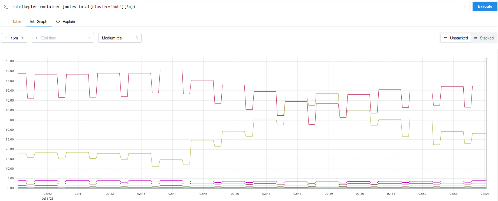

# **Deployment Guide: Multi-Cluster Kubernetes Sustainability Monitoring**

## **1. Introduction**

This document provides a comprehensive guide for deploying a multi-cluster monitoring system focused on sustainability metrics within a Kubernetes environment. The solution leverages **Kepler** for energy consumption metrics, the **OpenTelemetry (OTel) Collector** for metric aggregation and transport, and **Prometheus** for data storage.

### **1.1. Architecture Overview**


The deployment is based on a hub-and-spoke topology consisting of three [Kind](https://kind.sigs.k8s.io/) clusters:

  * **Hub Cluster**: The central cluster responsible for aggregating and storing monitoring data from all clusters.
  * **Cluster1 & Cluster2 (Spoke Clusters)**: Member clusters that collect their own sustainability metrics and forward them to the Hub Cluster.

### **1.2. Prerequisites**

Before proceeding, ensure your environment is configured with the following:

  * [Kind (Kubernetes in Docker)](https://kind.sigs.k8s.io/)
  * `kubectl` command-line tool
  * `git`

-----

## **2. Hub Cluster Deployment and Configuration**

This section details the setup for the central Hub Cluster.

### **2.1. Install Kube-Prometheus**

We begin by deploying the Prometheus Operator, which provides a full-fledged monitoring solution. It will be used on the Hub Cluster to store and query the collected metrics.

For detailed installation instructions, please refer to the official documentation: [Deploy the Prometheus Operator](https://sustainable-computing.io/installation/kepler/#deploy-the-prometheus-operator).

### **2.2. Install Kepler and OpenTelemetry Operator**

Kepler is responsible for collecting node power consumption data, and the OTel Operator simplifies the management of the OTel Collector. These components must be installed on **all** clusters (Cluster1, Cluster2 and Hub).

#### **2.2.1. Install Kepler**

Follow these steps to [deploy Kepler](https://sustainable-computing.io/installation/kepler/#deploying-kepler-on-a-local-kind-cluster) on each cluster.

**NOTE**: We set `OPTS=""` during the manifest generation to prevent Kepler from being scraped directly by Prometheus. Instead, we will configure the OTel Collector to scrape Kepler's metrics.

```bash
# Clone the Kepler repository
git clone --depth 1 git@github.com:sustainable-computing-io/kepler.git
cd ./kepler

# Build the manifest and deploy Kepler
make build-manifest OPTS=""
kubectl apply -f _output/generated-manifest/deployment.yaml
cd ..
```

#### **2.2.2. Install OpenTelemetry Operator**

The [OTel Operator](https://opentelemetry.io/docs/platforms/kubernetes/operator/#getting-started) depends on `cert-manager` for certificate management.

```bash
# 1. Install cert-manager
kubectl apply -f https://github.com/cert-manager/cert-manager/releases/latest/download/cert-manager.yaml

# Wait for cert-manager pods to be up and running...

# 2. Install the OTel Operator
kubectl apply -f https://github.com/open-telemetry/opentelemetry-operator/releases/latest/download/opentelemetry-operator.yaml
```

### **2.3. Configure the Hub OTel Collector**

The OTel Collector on the Hub Cluster serves two primary functions:

1.  Scrapes local metrics from its own Kepler and cAdvisor endpoints.
2.  Acts as a receiver for metrics sent from the Spoke Clusters.

#### **2.3.1. Grant RBAC Permissions**

The OpenTelemetry Collector requires specific RBAC permissions to interact with the Kubernetes API. This access is crucial for discovering resources like pods and nodes (service discovery) and for proxying requests to internal metrics endpoints like cAdvisor.

**`hub-collector-rbac.yaml`**

```yaml
apiVersion: rbac.authorization.k8s.io/v1
kind: ClusterRole
metadata:
  name: otel-collector-kubeletstats-role
rules:
- apiGroups: [""]
  resources:
  - "nodes"
  - "nodes/stats"
  - "nodes/proxy"
  - "services"
  - "pods"
  verbs:
  - "get"
  - "list"
  - "watch"
---
apiVersion: rbac.authorization.k8s.io/v1
kind: ClusterRoleBinding
metadata:
  name: otel-collector-kubeletstats-binding
subjects:
- kind: ServiceAccount
  # This name must match the ServiceAccount used by the OTel Collector
  name: hub-collector
  namespace: default
roleRef:
  kind: ClusterRole
  name: otel-collector-kubeletstats-role
  apiGroup: rbac.authorization.k8s.io
```

Apply the configuration:

```bash
kubectl apply -f hub-collector-rbac.yaml
```

#### **2.3.2. Create the OTel Collector Instance**

This configuration defines two distinct pipelines:

  * `metrics/from_hub`: Processes metrics originating from the Hub Cluster itself (Kepler, cAdvisor, etc.).
  * `metrics/from_spokes`: Receives metrics from the remote Spoke Clusters.

**`hub-collector.yaml`**

```yaml
apiVersion: opentelemetry.io/v1beta1
kind: OpenTelemetryCollector
metadata:
  name: hub
spec:
  image: otel/opentelemetry-collector:latest
  config:
    receivers:
      prometheus:
        config:
          scrape_configs:
            # Scrape config for Kepler pods.
            - job_name: 'kepler-pods'
              kubernetes_sd_configs:
                - role: pod
              relabel_configs:
                # Keep only pods in the 'kepler' namespace.
                - source_labels: [__meta_kubernetes_namespace]
                  action: keep
                  regex: kepler
                # Standard relabeling to construct the scrape address from pod IP and port.
                - source_labels: [__address__, __meta_kubernetes_pod_container_port_number]
                  action: replace
                  regex: ([^:]+):(?:\d+);(\d+)
                  replacement: $${1}:$${2}
                  target_label: __address__
                # Use the node name as the 'instance' label for clarity.
                - source_labels: [__meta_kubernetes_node_name]
                  action: replace
                  target_label: instance

            # Scrape config for cAdvisor metrics from all Kubernetes nodes.
            - job_name: 'kubernetes-cadvisor-central'
              kubernetes_sd_configs:
                - role: node
              scheme: https
              authorization:
                credentials_file: /var/run/secrets/kubernetes.io/serviceaccount/token
              tls_config:
                ca_file: /var/run/secrets/kubernetes.io/serviceaccount/ca.crt
                insecure_skip_verify: true
              relabel_configs:
                - action: labelmap
                  regex: __meta_kubernetes_node_label_(.+)
                # Target the Kubernetes API server to proxy the cAdvisor metrics endpoint.
                - target_label: __address__
                  replacement: kubernetes.default.svc:443
                # Dynamically set the metrics path for each node.
                - source_labels: [__meta_kubernetes_node_name]
                  regex: (.+)
                  target_label: __metrics_path__
                  replacement: /api/v1/nodes/$${1}/proxy/metrics/cadvisor

      # OTLP receiver for metrics sent from local sources (e.g., federated learning) in the Hub.
      otlp/hub:
        protocols:
          grpc:
            endpoint: 0.0.0.0:4317
          http:
            endpoint: 0.0.0.0:4318
      
      # OTLP receiver for metrics sent from remote spoke clusters.
      otlp/spokes:
        protocols:
          grpc:
            endpoint: 0.0.0.0:4327
          http:
            endpoint: 0.0.0.0:4328

    processors:
      # Adds a 'cluster' attribute to distinguish metrics originating from the Hub.
      attributes:
        actions:
        - key: cluster
          value: hub
          action: insert

    exporters:
      # Exposes all collected metrics on a Prometheus-scrapeable endpoint.
      prometheus:
        endpoint: "0.0.0.0:9464"

    service:
      pipelines:
        # Pipeline for metrics generated within the Hub cluster.
        metrics/from_hub:
          receivers: [otlp/hub, prometheus]
          processors: [attributes]
          exporters: [prometheus]
        # Pipeline for metrics received from spoke clusters.
        metrics/from_spokes:
          receivers: [otlp/spokes]
          exporters: [prometheus]
```

Apply the configuration:

```bash
kubectl apply -f hub-collector.yaml
```

#### **2.3.3. Expose the Collector Service**

To allow the Spoke Clusters to send metrics to the Hub, we must expose the OTel Collector's service externally. We will change the service type to `NodePort`.

```bash
kubectl patch svc hub-collector -n default -p '{"spec":{"type":"NodePort"}}'
```

**Action Required**: After running this command, take note of the `NodePort` assigned to the gRPC receiver port (`4327`). This port will be needed for the Spoke Cluster configuration.

#### **2.3.4. Create a ServiceMonitor**

This `ServiceMonitor` resource allows the Kube-Prometheus Operator on the Hub to automatically discover and scrape the metrics exposed by our OTel Collector.

**`hub-collector-smon.yaml`**

```yaml
apiVersion: monitoring.coreos.com/v1
kind: ServiceMonitor
metadata:
  name: otel-collector
  # Deploy this to the same namespace where Prometheus is running
  namespace: monitoring
spec:
  selector:
    matchLabels:
      operator.opentelemetry.io/collector-service-type: base
  namespaceSelector:
    matchNames:
      - default
  endpoints:
    - port: prometheus
      path: /metrics
      interval: 15s
```

Apply the configuration:

```bash
kubectl apply -f hub-collector-smon.yaml
```

-----

## **3. Spoke Cluster Deployment and Configuration**

The following steps must be performed on **both** Spoke Clusters (Cluster1 and Cluster2).

### **3.1. Install Kepler and OpenTelemetry Operator**

This process is identical to the Hub Cluster setup. Please refer to section **[2.2](#22-install-kepler-and-opentelemetry-operator)**.

### **3.2. Configure the Spoke OTel Collector**

The collector on each spoke is responsible for scraping local metrics and exporting them via OTLP to the Hub Cluster.

#### **3.2.1. Grant RBAC Permissions**

Spoke collectors require the same API access as the Hub collector to discover and scrape local targets.

**`spoke-collector-rbac.yaml`**

```yaml
# This is similar to the hub RBAC, but note the different ServiceAccount name
apiVersion: rbac.authorization.k8s.io/v1
kind: ClusterRole
metadata:
  name: otel-collector-kubeletstats-role
rules:
- apiGroups: [""]
  resources:
  - "nodes"
  - "nodes/stats"
  - "nodes/proxy"
  - "services"
  - "pods"
  verbs:
  - "get"
  - "list"
  - "watch"
---
apiVersion: rbac.authorization.k8s.io/v1
kind: ClusterRoleBinding
metadata:
  name: otel-collector-kubeletstats-binding
subjects:
- kind: ServiceAccount
  name: otel-collector
  namespace: default
roleRef:
  kind: ClusterRole
  name: otel-collector-kubeletstats-role
  apiGroup: rbac.authorization.k8s.io
```

Apply the configuration:

```bash
kubectl apply -f spoke-collector-rbac.yaml
```

#### **3.2.2. Create the OTel Collector Instance**

**Action Required**: Before applying this file, you must modify two critical values:

1.  **`processors.attributes.value`**: Change this to the unique name of the current cluster (e.g., `cluster1` or `cluster2`). This is essential for distinguishing metrics in Prometheus.
2.  **`exporters.otlp.endpoint`**: Replace the placeholder with the **IP address of your Hub Cluster's node** and the **gRPC NodePort** you recorded in section [2.3.3](#233-expose-the-collector-service).

**`spoke-collector.yaml`**

```yaml
apiVersion: opentelemetry.io/v1beta1
kind: OpenTelemetryCollector
metadata:
  name: otel
spec:
  image: otel/opentelemetry-collector-contrib:latest
  config:
    receivers:
      otlp:
        protocols:
          grpc:
            endpoint: 0.0.0.0:4317
          http:
            endpoint: 0.0.0.0:4318

      prometheus:
        config:
          scrape_configs:
            - job_name: 'kepler-pods'
              kubernetes_sd_configs:
                - role: pod
              relabel_configs:
                - source_labels: [__meta_kubernetes_namespace]
                  action: keep
                  regex: kepler

                - source_labels: [__address__, __meta_kubernetes_pod_container_port_number]
                  action: replace
                  regex: ([^:]+):(?:\d+);(\d+)
                  replacement: $${1}:$${2}
                  target_label: __address__

                - source_labels: [__meta_kubernetes_node_name]
                  action: replace
                  target_label: instance
            - job_name: 'kubernetes-cadvisor-central'
              kubernetes_sd_configs:
                - role: node
              scheme: https
              authorization:
                credentials_file: /var/run/secrets/kubernetes.io/serviceaccount/token
              tls_config:
                ca_file: /var/run/secrets/kubernetes.io/serviceaccount/ca.crt
                insecure_skip_verify: true
              
              relabel_configs:
                - action: labelmap
                  regex: __meta_kubernetes_node_label_(.+)
                - target_label: __address__
                  replacement: kubernetes.default.svc:443
                - source_labels: [__meta_kubernetes_node_name]
                  regex: (.+)
                  target_label: __metrics_path__
                  replacement: /api/v1/nodes/$${1}/proxy/metrics/cadvisor

    processors:
      attributes:
        actions:
        - key: cluster
          # !! IMPORTANT: Set the correct value for each spoke cluster !!
          value: cluster1 # or cluster2
          action: insert
          
    exporters:
      otlp:
        # !! IMPORTANT: Set the correct endpoint for the Hub's gRPC receiver !!
        endpoint: "HUB_NODE_IP:HUB_GRPC_NODE_PORT"
        tls:
          insecure: true

    service:
      pipelines:
        metrics:
          receivers: [otlp, prometheus]
          processors: [attributes]
          exporters: [otlp]
```

Apply the modified configuration:

```bash
kubectl apply -f spoke-collector.yaml
```

-----

## **4. Verification**

Once all components are deployed, you can verify the setup by accessing the Prometheus UI on your Hub Cluster. Execute a query for a Kepler metric, such as `kepler_container_joules_total`. The results should show data with distinct `cluster` labels (`hub`, `cluster1`, `cluster2`), confirming that metrics are being successfully collected and aggregated from all clusters.

Here are some examples:

* **`rate(kepler_container_joules_total{cluster="hub"}[5m])`**



* **`rate(container_cpu_usage_seconds_total{cluster="cluster1"}[5m])`**


* **`container_cpu_usage_seconds_total{exported_namespcae="open-cluster-management", cluster="cluster2"}`**


* **`container_cpu_usage_seconds_total{exported_pod=~"federated-learning-sample-.*"}`**


* **`{exported_job="unknown_service:fl_sidecar"}`**

